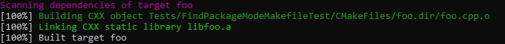
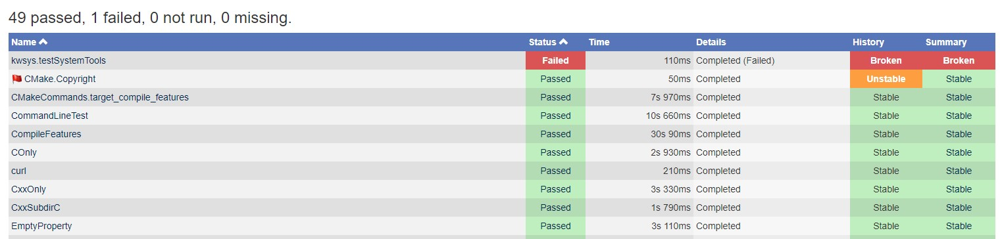
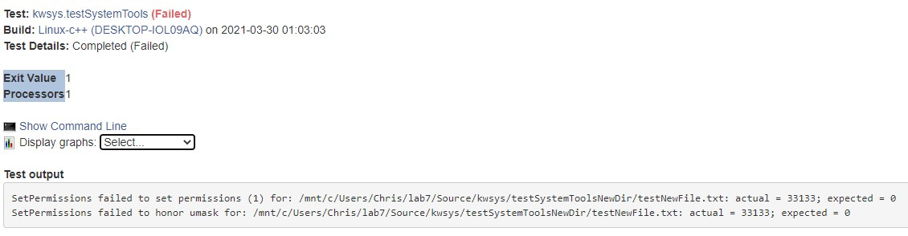
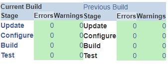

## Checkpoint 1

Proof of completed build:

## Checkpoint 2

1. 

- Under experimental, if you go to one of the submissions and click on the build name, you are taken to a page that summarizes the submission. If you scroll down and click "View Tests Summary", you can see the tests that were run.  

- By clicking the number in the "fail" column, you are taken to a list of the failed tests. From here, you can click on an individual error to examine it more closely. Here you can see what the expected and actual results were. This can help give the programmers insight into why their program failed. It allows them to compare/contrast what the intended funcionality of the program is with what was actually computed. 

- The dashboard is relatively clean, there are no errors observed. 

